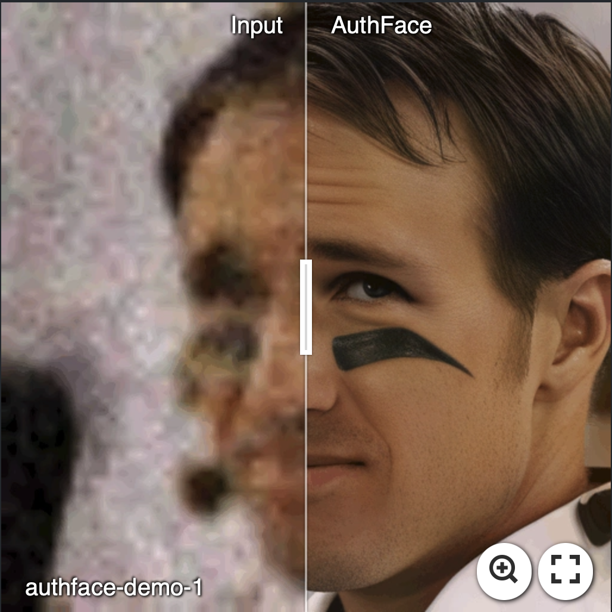
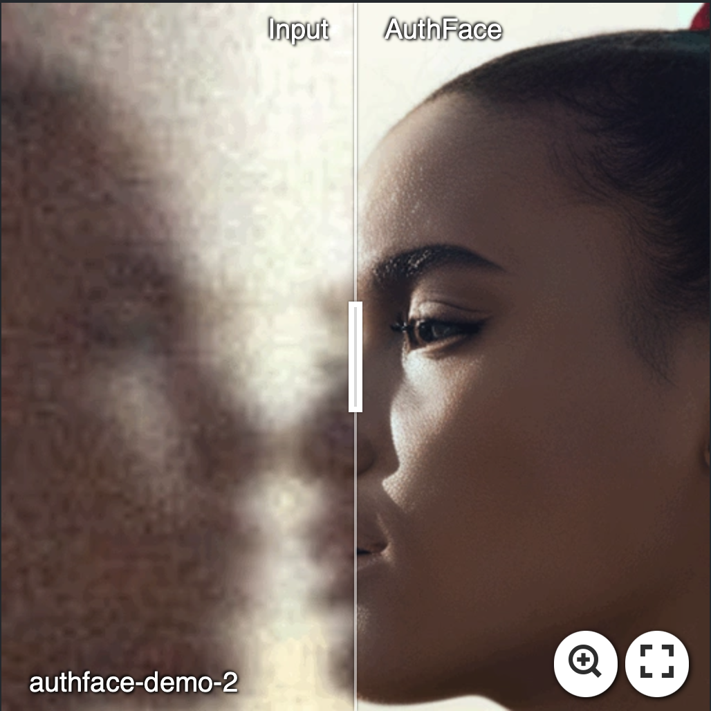
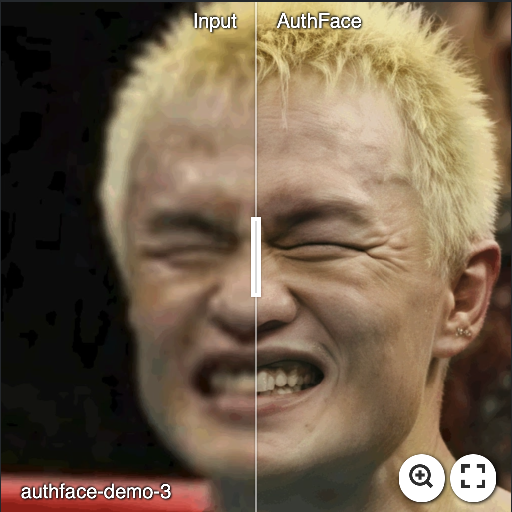
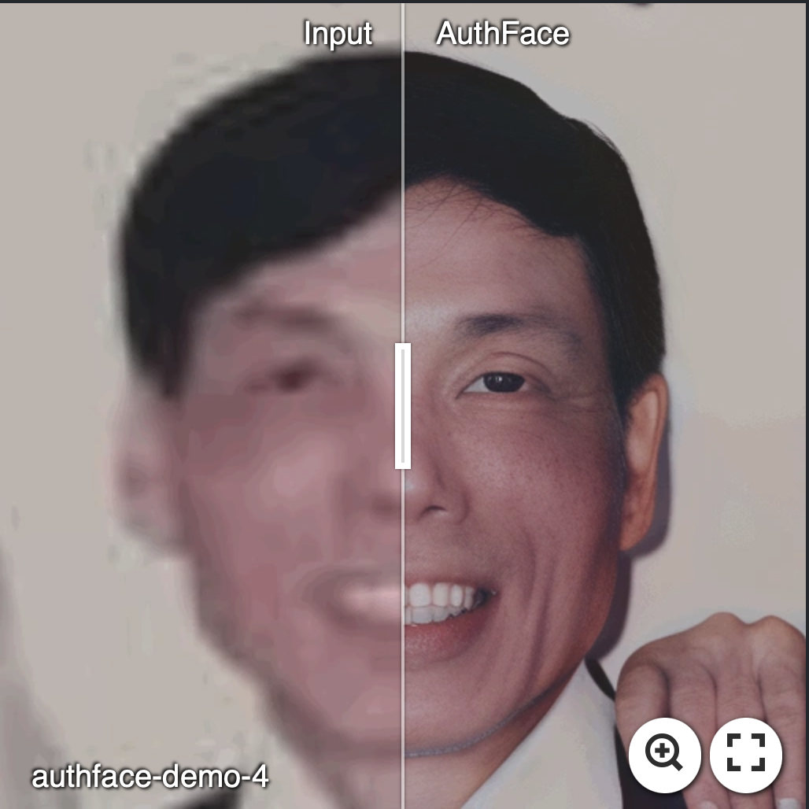

  
<h1>AuthFace: Towards Authentic Blind Face Restoration with Face-oriented Generative Diffusion Prior</h1>
  

  <a href='https://scholar.google.com/citations?user=GHz1gUIAAAAJ&hl=zh-CN' target='_blank'>Guoqiang Liang1,2
  <a> &emsp;
  <a href='https://scholar.google.com/citations?user=2cY2zwUAAAAJ&hl=zh-CN' target='_blank'>Qingnan Fan2
  <a> &emsp;
  <a >Bingtao Fu2&emsp;
  <a >Jinwei Chen2&emsp;
  <a >Hong Gu2&emsp;
  <a href='https://scholar.google.com/citations?user=SReb2csAAAAJ&hl=zh-CN' target='_blank'>Lin Wang1,3

  1Hong Kong University of Science and Technology (Guangzhou), 2Vivo, Hangzhou, 3Hong Kong University of Science and Technology&emsp; 

---

## News :loudspeaker:
- [2024.10] This repo is created.

## Real-World Results :camera:
 

 
